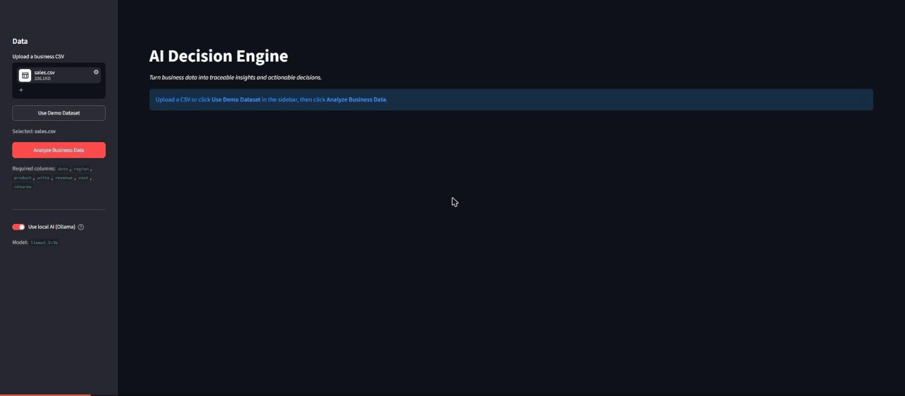
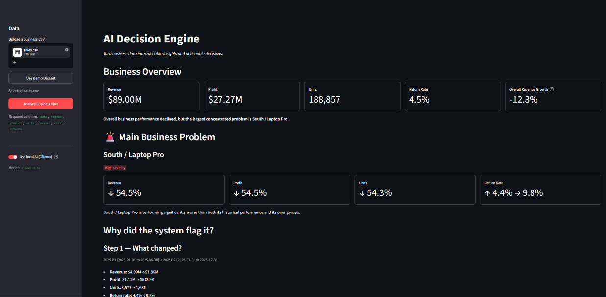
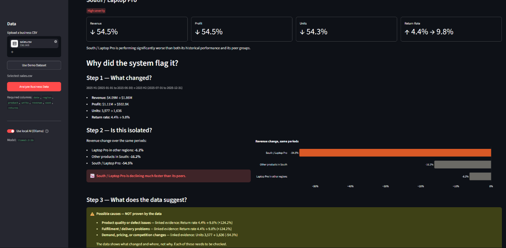
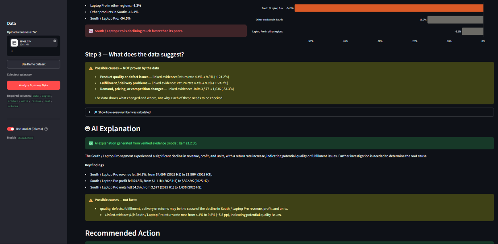
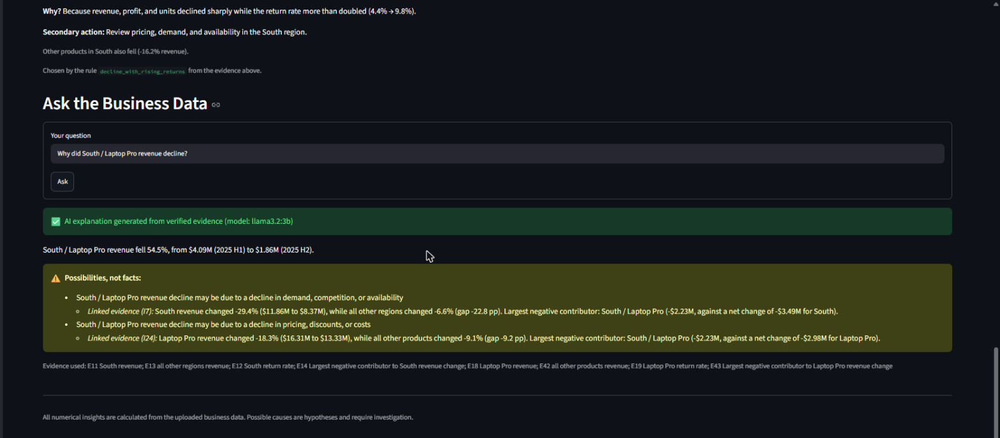

# AI Decision Engine for Business Data

Hackathon MVP: analyse business data, generate traceable insights, and recommend
decisions grounded in the underlying data.

**Python calculates every number. A local LLM only explains the evidence, and every LLM answer is checked before it is shown.**
See [docs/ARCHITECTURE.md](docs/ARCHITECTURE.md) for the design and the reasoning behind it.

Stack: Python · pandas · NumPy · Streamlit · Plotly · pytest · Ollama (`llama3.2:3b`, run locally).



| Overview → main problem | Why the system flagged it |
|---|---|
|  |  |
| **AI explanation (validated, evidence-linked causes)** | **Recommended action + Ask the data** |
|  |  |

*Screens from an uploaded sample dataset in which South / Laptop Pro revenue fell 54.5% and its return rate rose from 4.4% to 9.8%. The bundled demo dataset contains a milder version of the same problem.*

## Status

| Component | State |
|---|---|
| `data_generator.py` – synthetic e-commerce dataset | done |
| `analyzer.py` – loading, validation, KPIs | done |
| `engine.py` – insight, evidence & recommendation engine | done |
| `llm.py` – LLM explanation layer (Ollama) with deterministic fallback | done |
| `story.py` – top-issue presentation layer (one clear story per dataset) | done |
| `app.py` – Streamlit UI | done |
| `tests/` – 222 pytest tests (no Ollama needed) | done |

## Demo in 30 seconds

```bash
streamlit run app.py
```

1. In the sidebar, click **Use Demo Dataset**, then **Analyze Business Data**.
2. Scroll through the page:
   - Business Overview.
   - The key issue (South / Laptop Pro).
   - The evidence behind it.
   - The AI explanation.
   - The recommended action.
   - Ask a question, e.g. "Why did revenue decline?"

With local AI switched on, the first explanation takes about 1–2 minutes on CPU; after that it is cached. Switch **Use local AI (Ollama)** off for instant, evidence-only explanations.

## Setup

```bash
python -m venv .venv
.venv\Scripts\activate          # Windows  (macOS/Linux: source .venv/bin/activate)
pip install -r requirements.txt
```

## Run

```bash
python data_generator.py         # writes data/sales.csv (7,300 rows, seed 42)
pytest -v                        # run tests
python engine.py --out data/decision_report.json   # decision report
python llm.py data/decision_report.json            # LLM explanation (falls back if Ollama is down)
```

`data_generator.py` accepts `--seed`, `--start`, `--end`, and `--out`.

## Dataset

One row per day × region × product for 2025:

| column | meaning |
|---|---|
| `date` | YYYY-MM-DD |
| `region` | North, South, East, West |
| `product` | Laptop Pro, Laptop Air, Tablet, Smartwatch, Headphones |
| `units` | units sold |
| `revenue` | gross sales after discount, before returns |
| `cost` | cost of goods sold |
| `returns` | units returned |

### Planted business problem

From 2025-07-01 the data contains a problem that ramps up gradually. The engine should find it without being told:

- The whole **South** region softens, losing up to 12% of units. It is the only region whose H2 revenue is lower than H1.
- **Laptop Pro in the South** drops sharply: units fall about 55% by year end, and deeper discounting erodes revenue per unit.
- Its **return rate** climbs from about 4% to about 16%, averaging about 13% in Q4, while other regions stay near 4%.

## KPIs (`analyzer.py`)

- `load_data(path)` reads the CSV and validates it.
- `validate_data(df)` checks for required columns, parseable dates, numeric values, nulls, negatives, and returns greater than units. It raises `DataValidationError` with every issue it finds.
- `calculate_kpis(df)` returns revenue, cost, profit, profit margin, units, returns, and return rate.
- `kpis_by(df, cols)` returns the same KPIs grouped by any columns.

## Decision engine (`engine.py`)

All numbers are calculated deterministically in Python. There is no LLM in this module.

`CSV -> analyzer -> compare_periods -> segment analysis -> detect_insights -> generate_recommendations -> generate_decision_report`

- **Periods:** by default the data's months are split into two halves (`2025 H1` vs `2025 H2`). Pass your own `Period` objects to override this.
- **Segments:** the engine looks at the business overall, by region, by product, and by region + product. It compares each segment with its own previous period and with a *baseline* of comparable peers. For example, South / Laptop Pro is compared with Laptop Pro in other regions and with other products in the South. This separates a local problem from a business-wide change such as seasonality.
- **Insight types:**
  - `revenue_decline`, `profit_decline` and `units_decline`: a drop of at least 10%.
  - `return_rate_increase`: at least +20% relative, at least +0.5 pp, and a z-score of at least 3 in a two-proportion test.
  - `region_specific_decline`, `product_specific_decline` and `concentrated_decline`: revenue fell and the segment trails every baseline by at least 5 pp.

  All thresholds are in `Thresholds`.
- **Evidence:** each evidence item records the filters, date ranges, values and row counts used, so it can be recomputed from the CSV. The tests do exactly that.
- **Recommendations:** fixed rules applied to the detected insight types (see `RULES`):
  - A decline together with rising returns leads to a check of quality, fulfillment and customer experience.
  - A decline with stable returns leads to a check of demand, pricing and availability.
  - Rising returns without a decline lead to a returns audit.
  - A falling profit margin leads to a pricing and discount review.

  Region- or product-level findings explained by a single region + product segment are merged into that segment's recommendation.

## LLM explanation (`llm.py`)

`Raw CSV -> deterministic analysis -> structured evidence -> LLM explanation`

The LLM only *explains* the report. It never sees the CSV and never calculates metrics.

- **Setup:** install [Ollama](https://ollama.com), then run `ollama pull llama3.2:3b`.
- **Environment variables:**

  | Variable | Default |
  |---|---|
  | `OLLAMA_MODEL` | `llama3.2:3b` |
  | `OLLAMA_URL` | `http://localhost:11434` |
  | `OLLAMA_TIMEOUT` | `180` seconds |

- **Input:** `explain_decision_report(report)` sends the model a compact context of about 3 KB. It contains each insight's ID, segment, values and evidence summary, plus the engine's recommendations.
- **Output:** the model returns `summary`, `key_findings`, `reasoning` (observed facts kept separate from possible explanations) and `recommendations`. Evidence IDs and `evidence_references` are then attached in code from the insights the model cites.
- **Validation:** every response is checked before use:
  - JSON shape.
  - All insight and recommendation IDs exist, and every report recommendation is covered.
  - Every number matches a number in the report, allowing for display rounding.
  - No cause is stated as fact ("caused by", "due to", "attributed to"… without "may", "might" or "could").
  - No certainty words.
  - No metrics the data doesn't have (traffic, conversion, NPS…).
  - No number attached to the wrong segment (e.g. a South / Laptop Pro figure described as the South region's).
  - No forecasts: the report covers past periods only.
  - **Evidence-linked causes.** Each possible cause is `{cause, evidence, linked_insight_ids}`. It must:
    - be hedged,
    - cite real findings and quote their evidence,
    - name a business hypothesis rather than restate a metric,
    - cite the right kind of finding: quality or delivery causes need a return-rate finding, pricing causes a profit or revenue finding, demand causes a decline.

    Any possible explanation must also be flagged `needs_further_investigation`.
- **Retry and fallback:** on failure, the model gets one retry with the list of problems. If Ollama is down, or the answer still fails, a deterministic explanation built from the report is returned. `metadata.source` says which one you got (`llm` or `fallback`) and why.

```bash
python llm.py [report.json] [--fallback-only] [--model NAME] [--out FILE]
python llm.py data/decision_report.json --question "Why did revenue decline?" --question "What should we do first?"
```

## Presentation layer (`story.py`)

The engine detects every finding, and the JSON report keeps all of them. For a short demo, the UI shows only the single most important problem: the top-priority recommendation's segment, preferring a concentrated region + product decline. It walks through that problem in three steps:

1. What changed?
2. Is it isolated (compared with its peer groups)?
3. Possible causes, clearly labelled as not proven.

The UI shows one primary action and at most one secondary action.

All sentences are chosen by explicit conditions on computed numbers, and every number on the page has an evidence row in the collapsed **"🔎 Show how every number was calculated"** section. The AI explanation and the question box use a focused copy of the report that contains only the top issue's findings and evidence. That makes them shorter and faster: the model context is about 3 KB instead of about 13 KB.
