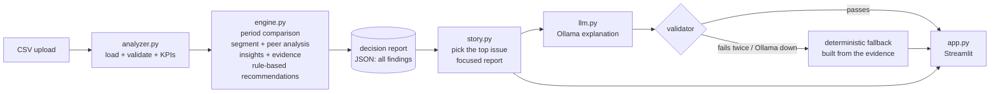

# Architecture

**One-line pitch:** a decision engine where Python calculates every number, each number carries evidence that can be traced back to the source rows, and a local LLM is only allowed to *explain* that evidence. Every LLM answer is checked before anyone sees it.

## Layers

| Layer | File | Responsibility | Can it invent anything? |
|---|---|---|---|
| Data | `analyzer.py` | Load the CSV and check the schema, dates, numeric values, missing values, negatives, and returns ≤ units. Calculate the KPIs. | No |
| Analysis | `engine.py` | Compare two periods. Check every region, product and region + product segment against its own past *and* against its peers. Detect insights, attach evidence, and apply fixed recommendation rules. | No |
| Presentation | `story.py` | Pick the single most important issue. Build a 3-step story from it: what changed, is it isolated, possible causes. Build a focused copy of the report. | No |
| Explanation | `llm.py` | Turn the focused report into plain English using local Ollama. Validate the output; fall back if needed. | It can try. The validator blocks it. |
| UI | `app.py` | Streamlit page for a 3-minute demo. | No |

## Key design decisions (and why)

1. **Deterministic numbers, LLM for language only.** LLMs are unreliable at arithmetic and tend to invent plausible figures. The model never sees the CSV, only a compact summary of about 3 KB, and it is never asked to calculate anything.
2. **Peer baselines, not just period-over-period.** In the demo data, H2 revenue is up overall because of the holiday season. A plain "down 10%" rule misses a region that fell while everyone else grew. Each segment is therefore compared with "everything else": other regions, or the same product in other regions plus other products in the same region. This is what separates a *concentrated* problem from a business-wide trend.
3. **Statistical guard on rates.** A return-rate alert also requires a two-proportion z-score of at least 3. Without it, noise across 20 region + product combinations produces false alarms.
4. **Evidence as data.** Every evidence item stores:
   - its filters, e.g. `region=South, product=Laptop Pro`,
   - the exact date ranges,
   - the values and the row counts.

   The tests recompute every evidence item from the raw CSV with plain pandas.
5. **Rule-based recommendations.** Actions come from explicit rules such as "decline with rising returns → investigate quality / fulfillment before adding inventory". This keeps them explainable and auditable. The LLM rephrases them; it doesn't decide them.
6. **Show one story, keep everything.** The engine found 31 overlapping findings in one test dataset. The UI shows the top issue; the full JSON report keeps all findings and can be downloaded.

## How LLM output is kept honest

Every explanation and every answer to a question is rejected if:

- **The JSON is wrong:** it is malformed or the wrong shape.
- **An ID is wrong:** it cites a finding or recommendation ID that doesn't exist.
- **A number doesn't match:** a number isn't in the report (allowing for display rounding), or is attached to the wrong segment. For example, "the South region fell 54.5%" when 54.5% is South / Laptop Pro's figure.
- **A cause is stated as fact:** "caused by", "due to" or "driven by" without "may", "might" or "could", or certainty words such as "definitely" or "proves".
- **A metric the data doesn't have appears:** traffic, conversion, NPS and similar.
- **A possible cause is not evidence-linked.** Each cause must:
  - be hedged,
  - cite real findings and quote their evidence,
  - name an actual business hypothesis, not restate a metric,
  - cite the right *kind* of finding: quality or delivery causes need a return-rate finding, pricing causes a profit or revenue finding, and demand causes a decline.
- **It makes a forecast:** the report covers past periods only.

On failure the model gets one retry, with the list of problems fed back. If that fails too, or Ollama is down, a deterministic explanation built from the same evidence is shown. The UI always says which one the user is seeing.

## Testing (pytest, 222 tests, no Ollama required)

- **KPIs and validation:** the KPI maths and the data validation rules.
- **Planted problem:** the synthetic dataset has a known problem, and the tests check it is detected, with no false positives in a healthy control dataset.
- **Evidence:** every evidence number is recomputed from the CSV.
- **LLM validator:** one test for each rejection rule, with mocked Ollama responses.
- **UI:** the full page is run headlessly with Streamlit's `AppTest`.

## Known limitations / next steps

- Only two periods are compared (first half vs second half). Next step: rolling windows and seasonality-adjusted baselines.
- Segments cover only region × product. More dimensions, such as channel or customer type, would mean more combinations and need multiple-comparison control.
- A 3B model on CPU takes 1–3 minutes per explanation. A larger model or a GPU would give faster, richer prose. The guardrails stay the same.
- Causes are hypotheses by design: the data can show *where* and *what*, not *why*.

## Likely interview questions

**Why not let the LLM analyse the CSV directly?**
It would calculate numbers you can't trust or trace. Here every number is reproducible, the LLM's output is checked against those numbers, and a bad answer is replaced instead of shown.

**How do you know a finding is real and not noise?**
Three things. Thresholds are set on both the size of the change and the gap to peers. Return rates also need a z-score of at least 3. And the tests check a healthy control dataset produces no findings.

**What happens when the model hallucinates?**
The validator catches it, for example an invented number, a misattributed number, a stated cause or an unlinked cause. The model gets one retry with the specific errors, then the deterministic fallback is used. The UI labels the source.

**How would you scale this?**
Push the aggregation into DuckDB or a warehouse; the evidence format stays the same. Run the analysis on a schedule. Cache explanations per report hash. Swap Ollama for a hosted model behind the same validator.
